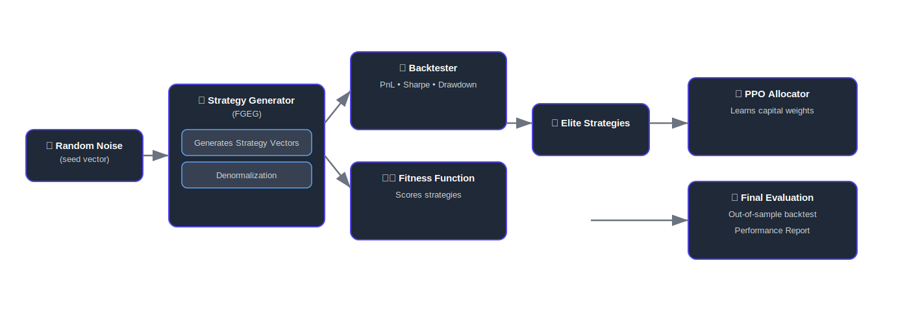

# 🚀 Quant Strategy Generator & Allocator

This project is an **end-to-end automated quant trading pipeline**.  
It doesn’t just backtest one strategy — it **creates**, **allocates**, and **evaluates** entire portfolios of strategies using AI.

---

## ✨ What It Does

1. **Strategy Generation** 🧬  
   - A custom neural generator (FGEG) invents trading strategies.  
   - Instead of a human tweaking indicators, the system learns profitable patterns directly.  

2. **Capital Allocation** 📊  
   - A reinforcement learning agent (PPO) decides how much capital each strategy gets.  
   - Ensures diversification, risk control, and max returns.  

3. **Evaluation** ✅  
   - Final portfolio is stress-tested on unseen market data.  
   - Reports total PnL, annualized returns, and drawdowns.  

---

## 🖼️ How It Works



---

## ⚡ Quickstart

```bash
git clone https://github.com/yourusername/quant-strategy-gen.git
cd quant-strategy-gen
python main.py
